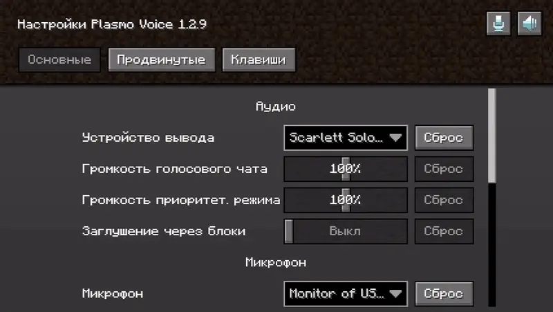
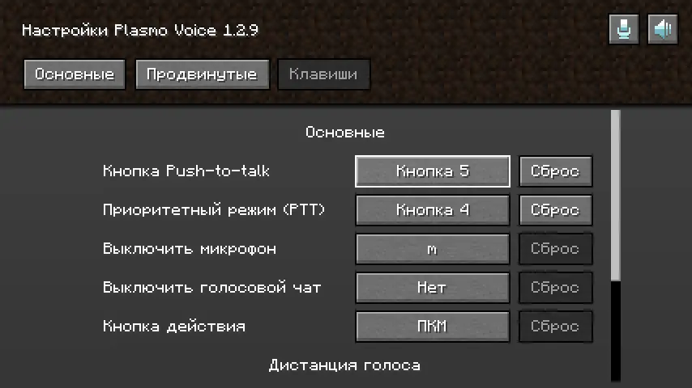
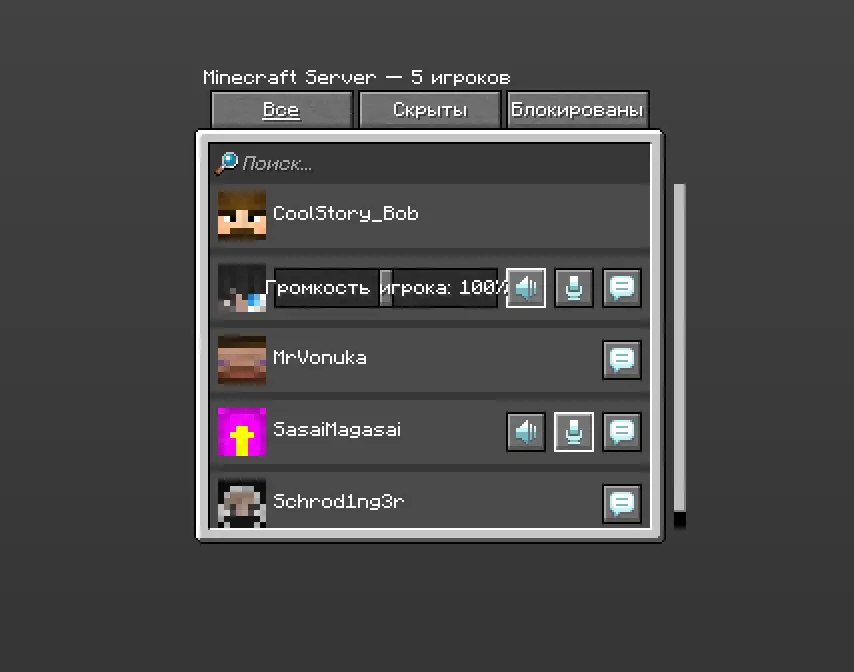
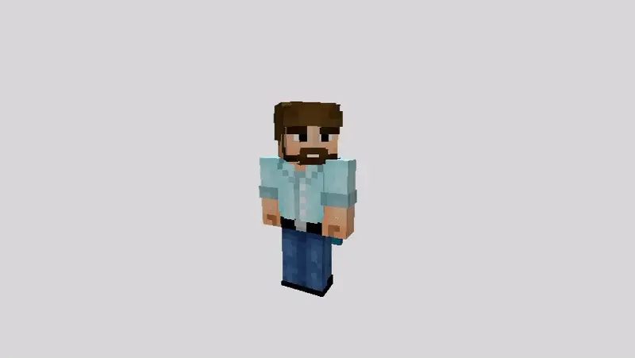
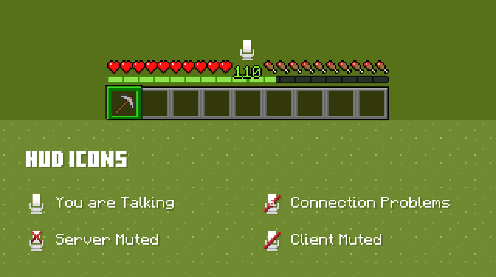
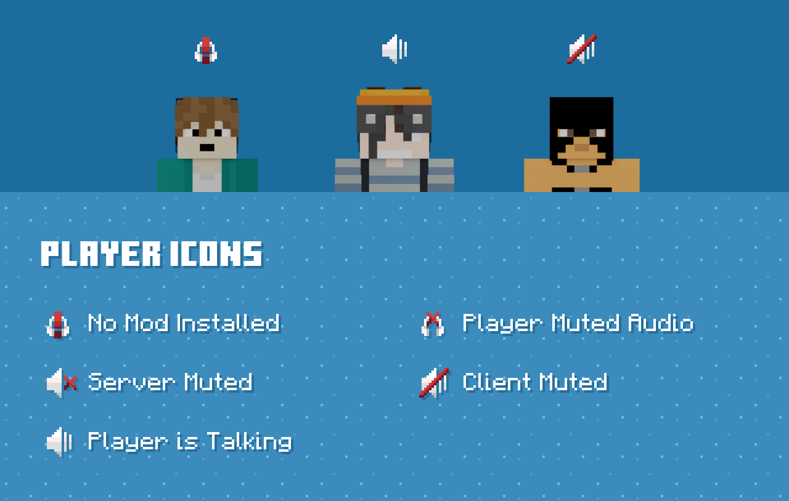

# Голосовой чат

> [<mark style="color:green;">**`Скачать PlasmoVoice`**</mark>](https://modrinth.com/plugin/plasmo-voice)

## Как пользоваться 

Нажмите на клавишу <mark style="color:green;">**`V`**</mark> _(английскую)_ по умолчанию, чтобы открыть меню настройки

<figure><figcaption></figcaption></figure>

Выберите микрофон, а затем нажмите на иконку рядом с <mark style="color:green;">**`Порог активации`**</mark>. Если полоска становится зеленой, значит микрофон работает

<figure><figcaption></figcaption></figure>

Выйдите из меню и нажмите на <mark style="color:green;">**`Левый альт`**</mark>, чтобы говорить. Изменить кнопку можно в вкладке <mark style="color:green;">**`Клавиши`**</mark>

<figure><figcaption></figcaption></figure>

Зайдите в социальное меню Minecraft, чтобы заглушать и изменить громкость игроков. Кнопка <mark style="color:green;">**`P`**</mark> по умолчанию

<figure><figcaption></figcaption></figure>

Зажмите <mark style="color:green;">**`ПКМ`**</mark> и крутите колёсико мыши, чтобы изменять громкость не заходя в меню

<figure><figcaption></figcaption></figure>

## Значение HUD иконок 

<figure><figcaption></figcaption></figure>

## Значение иконок над игроками 

<figure><figcaption></figcaption></figure>
