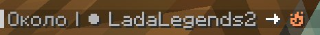

# Чат

### Локальный и глобальный чат

Локальный чат (радиус: 100м).

Глобальный чат (радиус: весь сервер). Для отправки сообщений в глобальный чат перед сообщением введите восклицательный знак (!)

### Цветные эмоджи

Для просмотра доступных эмоджи используйте `/emotes`. Для отправки эмодзи в чат напишите тег эмодзи внутри двоеточия. Например _:fire:_ выведет эмодзи огня в чат.

<figure><figcaption></figcaption></figure>

### Личные сообщения

Личные сообщения нужны для разговора наедине с собеседником.

Список команд

#### `/msg <player> <message>`

Отправить личное сообщение другому игроку.

Псевдонимы:`/message`, `/tell`, `/t`, `/whisper`, `/dm`, `/m`,`/pm`

#### `/msg <player>`

Создайте личный канал сообщений для игрока; т.е. все ваши сообщения чата будут отправляться как личные сообщения этому игроку. Выполните команду еще раз, чтобы отключить канал сообщений.

Псевдонимы:`/message`, `/tell`, `/t`, `/whisper`, `/dm`, `/m`,`/pm`

#### `/reply <message>`

Отправьте личное сообщение последнему игроку, который вам написал.

Псевдонимы:`/r`,`/re`

#### `/teammsg <message>`

Отправьте личное сообщение вашей [команде табло](https://minecraft.fandom.com/wiki/Scoreboard#Teams) .

Псевдонимы:`/tm`, `/tmsg`,`/teamchat`

#### `/teammsg`

Добавляет много новых специальных имен, подобных _Jeb\__ или _Dinnerbone_, которые можно давать мобам!

Создайте личный канал сообщений для вашей [команды табло](https://minecraft.fandom.com/wiki/Scoreboard#Teams) ; т.е. все ваши сообщения чата будут отправляться как личные сообщения команды. Запустите команду еще раз, чтобы отключить канал сообщений.

Псевдонимы:`/tm`, `/tmsg`,`/teamchat`

#### `/ignore <player>`

Игнорируйте игрока — вы перестанете видеть все его сообщения (включая сообщения в публичном чате).

Псевдонимы:`/block`

#### `/unignore <player>`

Вы перестанете игнорировать игрока и снова сможете видеть его сообщения.

Псевдонимы:`/unblock`

#### `/togglemsg`

Включить или отключить получение личных сообщений. Когда ваши личные сообщения отключены, никто не может отправлять вам сообщения, но вы все равно можете отправлять сообщения.

Псевдонимы:`/toggledms`,`/togglepms`

#### `/togglemsg <player>`

Включить или отключить получение личных сообщений другого игрока.

Псевдонимы:`/toggledms`,`/togglepms`


Личные сообщения могут просматриваться администрацией

